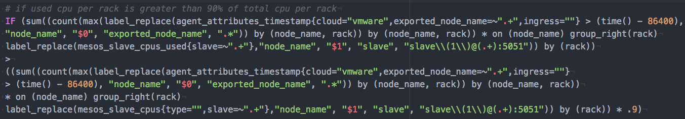
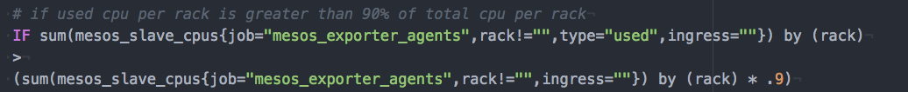

# Mesos Agent Attribute Appender

The **mesos-agent-attribute-appender** is for those of us who have torn our hair out writing veeeery loooong Prometheus queries because the [mesosphere/mesos-exporter](https://github.com/mesosphere/mesos_exporter) metrics don't contain the Mesos agent attributes.  Currently, the mesos-exporter only provides the option to export a separate metric with this information, which doesn't help with our long queries much.

Seriously, look at this madness.

ORIGINAL QUERY:

ewwwwwwww

But that's where mesos-agent-attribute-appender comes in! Just run it on all your agent nodes (e.g. as a systemd unit), and set up your Prometheus to scrape this thing for your agent metrics instead. It appends the attributes from the `mesos-slave-common` file as new labels onto the end of each metric.

IMPROVED QUERY:

ahhhhh :)

# Usage
You will need to pass it the following environment variables:

- `PRIVATE_IPV4`, the IP address of the Mesos agent.
- `MESOS_SLAVE_COMMON_PATH`, the location on the agent where the `mesos-slave-common` file (containing the slave attributes) can be found.
- `MESOS_EXPORTER_PORT`, the port that `mesosphere/mesos-exporter` is running on.
- `PORT`, the port that the mesos-agent-attribute-appender will run on (defaults to `19001`--make sure your mesos-exporter is not using the same port.)
